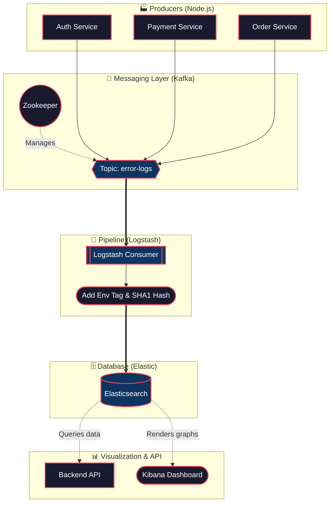

<div align="center">
  <h1>🔍 FaultLens <br/> <small>Real-Time Error Monitoring System</small></h1>

  <p>A fully distributed, scalable, and real-time big data processing pipeline designed to capture, process, and visually analyze error logs across a microservice architecture.</p>

  
  
  
  
  
</div>

---

## 🏗️ Architecture Blueprint



---

## 🔄 The Data Flow Journey

1. 🏭 **Producers:** The 3 microservices simulate heavy traffic. When an "error" occurs, they immediately generate a rich JSON log.
2. 🚀 **Streaming:** Logs are blasted onto an Apache Kafka high-speed conveyor belt. Kafka buffers them, ensuring zero data loss during traffic spikes.
3. 🧹 **Processing:** Logstash reads from Kafka. It automatically tags the log as `production` and runs an advanced **SHA1 Fingerprint Filter** to hash the exact error message. This allows for lightning-fast grouping later!
4. 🗄️ **Storage:** The cleaned logs are permanently deposited into Elasticsearch.
5. 📊 **Consumption:** Kibana provides a stunning UI, while a custom Express API allows developers to fetch, filter, or group logs programmatically.

---

## 🚀 Quick Start / How to Run

You can spin up this massive architecture with a single command!

1. Open a terminal in the root folder.
2. Run the Docker Compose master command:
   ```bash
   docker compose up --build -d
   ```
3. Wait ~60 seconds for the industry-grade services (Elastic, Kafka, Logstash) to awaken and begin routing data.

---

## 🔌 Using the Custom Backend API

The Express API exposes powerful querying methods to fetch data from Elasticsearch natively. It runs locally at `http://localhost:3000`.

| Endpoint | Method | Description |
| :--- | :--- | :--- | 
| `/errors` | `GET` | Fetch recent raw logs. |
| `/errors?service=payment-service` | `GET` | Filter logs by microservice name. |
| `/errors?level=error` | `GET` | Show only critical errors (filtering out warnings). |
| `/errors?userId=user-123` | `GET` | Find the stack-trace for a specific affected user. |
| `/errors/grouped` | `GET` | **Advanced:** Automatically sorts and counts occurrences of errors based on their mathematical `messageHash`. |

*Note: The API continuously runs a background threshold monitor, and if errors spike above a given rate, it issues automated alerts inside the console!*

---

## 📈 Visualizing with Kibana

Kibana acts as the "Command Center Dashboard" taking the raw JSON and turning it into beautiful visuals.

1. Go to **[http://localhost:5601](http://localhost:5601)**
2. Navigate to **Management > Stack Management > Data Views**.
3. Create a view named `error-logs-*` and map it to `@timestamp`.
4. Go to **Discover** to see a live-updating heartbeat of your entire microservice infrastructure!

---

## 📁 Directory Structure

```text
FaultLens/
 ├── docker-compose.yml       # 🛳️ The master orchestrator
 ├── README.md                # 📖 You are here
 │
 ├── services/                # 🏭 The Mock Factories
 │    ├── auth-service/       
 │    ├── payment-service/    
 │    └── order-service/      
 │
 ├── logstash/                # 🧹 The Data Processor
 │    ├── pipeline.conf       # Mapping & Hashing logic
 │    └── templates/          # Database mapping schemas
 │
 └── backend-api/             # 🧠 The Smart Librarian
      ├── index.js            # Express routing and search logic
      ├── package.json
      └── Dockerfile
```
